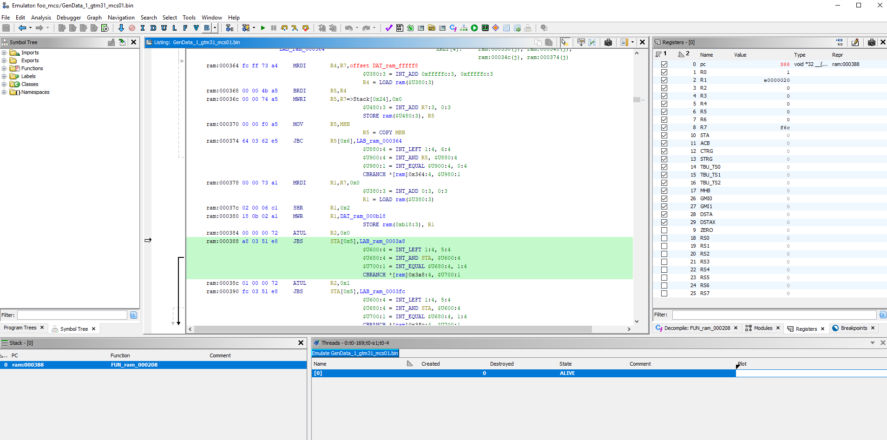

# Ghidra-GtmMcs-Processor
Disassembler, decompiler and emulator for Bosch GTM MCS by Antonio Della Rovere

This is my take on a GTM MCS Processor for Ghidra. 
It is not perfect nor complete, but it helped me out in finding a bug in the MCS code of which I did not have the source code. 

## Installation

Copy this folder to \<GhidraInstallDir\>\Ghidra\Processors\\**GtmMcs** folder and restart Ghidra.

## Usage

### Get the GTM MCS binary data

First of all you need the binary file of the MCS project.
I dumped the binary file directly from Lauterbach Trace32, as my Aurix project contains the C-Array data:

### Analyze in Ghidra

Now you can import the file to Ghidra. Firstly, create an empty project and import the binary file to it.

Note: It is important to know, that the GTM MCS Processor expects the Jump table for ch0-ch7 right at address **0x0000**.

Secondly, you are asked to select the language for the file. Here you go ahead and select this GtmMcs Processor.

Now if you open the imported bin file with Code Browser you are asked to analyze the file. 
After the analysis is complete you end up with the disassembler listing and decompiled C listing:

You can have a look at the control flow or other views as well:

### Bonus: Emulator

As the Ghidra GTM MCS Processor is translating the instruction set to P-Code, you can run or single step the binary file in the built in Emulator:

I hope you find this repo useful,

Antonio.
